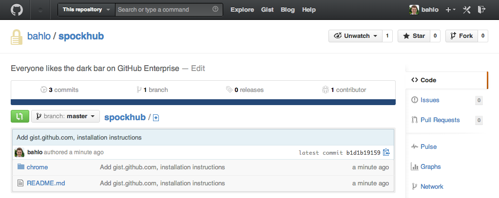

# Spockhub
A Chrome extension to switch to the beautiful dark bar at GitHub which is used
for Enterprise setups.

## Installation

### Chrome
1. Clone this repo: `git clone git@github.com:bahlo/spockhub.git`
2. Open <chrome://extensions/>
3. Make sure `Developer mode` on the top right is checked
4. Click on `Load unpacked extension…` and choose your cloned repo

###Safari

1. Clone this repo: `git clone git@github.com:bahlo/spockhub.git`
2. Double-click Spockhub.safariextz

## License

This project is licensed under the [WTFPL](http://www.wtfpl.net/).
